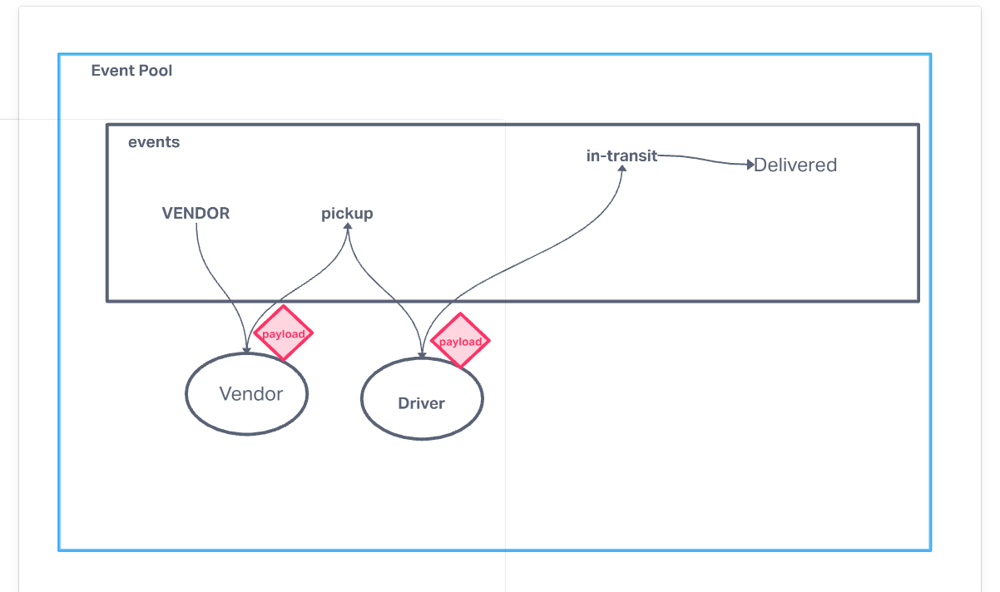

# caps

## Project: caps

### Author: Jordan Covington

### Problem Domain

Driver and Vendor eventPools

### Links and Resources

- [GitHub Actions ci/cd](https://github.com/JMCov/auth-api/actions)

### Setup

#### `.env` requirements (where applicable)

N/A

#### How to initialize/run your application (where applicable)

- e.g. `npm start`

#### Tests

fill this in as you see fit
- How do you run tests?
nodemon
- Any tests of note?
No
- Describe any tests that you did not complete, skipped, etc
N/A

#### UML

Collaborators:

Joe Davitt
Ty Aponte

